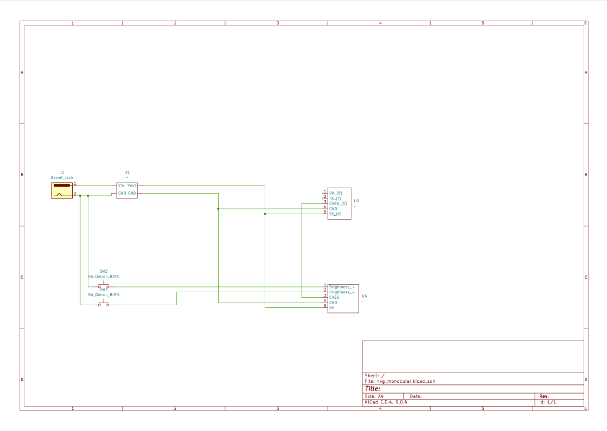
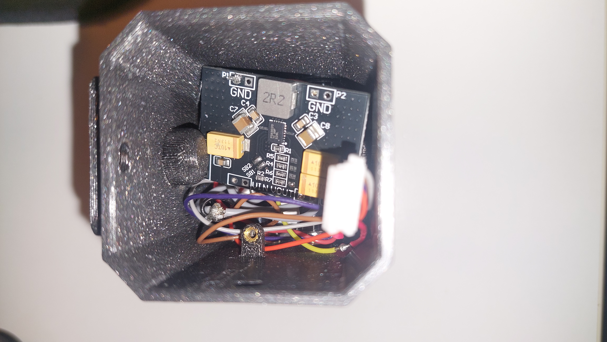

# Night Vision Monocular Device

## Intro

This project is a DIY night-vision monocular built from a RunCam Night Eagle 3 v2 analog camera and a small OLED display in a custom 3D‑printed housing. The case is designed to mount either on a head harness or on any Picatinny rail, making it usable as a helmet-mounted NVG or a simple rail-mounted viewer. It works with any IR torch or illuminator, is cheap and easy to assemble from off‑the‑shelf parts, and because the signal path is fully analog, latency is extremely low—so you can wear it for long periods without the motion sickness or headaches common with digital solutions.

## BOM

See [Bill of Materials](docs/BOM.md) for complete parts list.

## Build steps

1. Prepare the 3D printed parts
    - Insert all heat-inserts into the printed parts according to the model.
    - Make sure they sit flush and straight.
2. Thermal coupling
    - Apply thermal paste (or similar thermal interface material) onto the camera like in the image.

3. Mount the camera to the aluminium housing
    - Place the RunCam Night Eagle 3 v2 into the CNC aluminium camera housing.

    - Fix it in place using the two side screws.

4. Solder the wiring
    - Solder the camera, display, buttons and power leads according to the wiring diagram.

5. Install electronics into the body
    - Slide wiring into the main body housing.
    - Route wires so they are not pinched and have basic strain relief.
6. Close the housing
    - Attach the aluminium camera housing to the main body with four screws.

    - Verify the assembly is square and the camera is centered.
    - Verify the display and camera position are in line (you see the image as is, not flipped 90/180 degrees)
7. Install the optical lens
    - Connect the display to the camera
    - Install the display board in the slot on the image

    - Insert the display part into the housing, and fasten with 2 screws (M3x6)
    - Adjust focus as needed. 
8. Power-up and basic test
    - Connect a stable 5 V power supply.
    - Verify the display shows the camera image and there is no flicker or noise.
9. Button and brightness check
    - Press the buttons to confirm they adjust display brightness (brighter/dimmer) as expected.
    - If needed, re-check wiring for the button lines.

## Troubleshooting

The camera itself can get quite hot to the touch, if encased in PLA, it can melt the casing after while. The solution for this is to make the housing from aluminium with CNC. Mount the camera in the aluminium case and use thermal paste to make contact with it for better heat trasfer.

## Future improvements

- Better housing with support for picatiny mount on the other side
- Integrated power attachment
- Onboard recording using RunCam module and SD-card
- Weather sealing - gaskets and o-rings for outdoor abuse